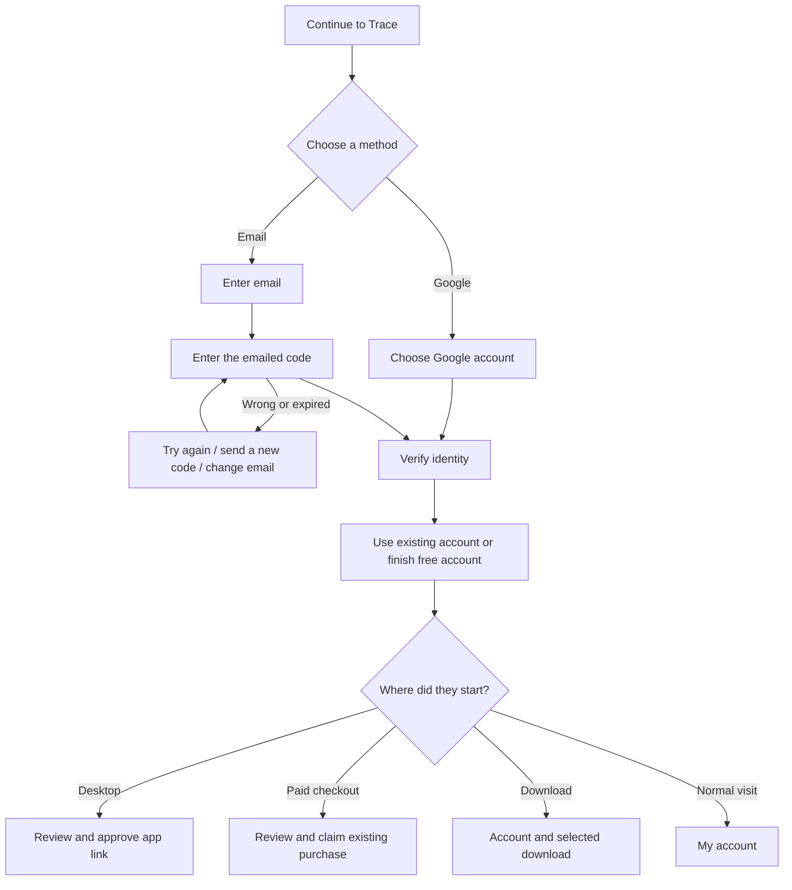

# Trace unified sign-in — September 29, 2026

## Player flow

One entry screen serves `/trace/login`, `/trace/signup`, and the old recovery entry point. It offers Google (only after configuration) and email codes. The sign-in page has no password option; existing accounts can also use email codes. Legacy password API compatibility remains.

No account-existence lookup is exposed to the browser. Signing in alone never purchases a plan or approves a device. Context accepts only known plan names, platforms, setup mode and properly shaped app-link codes; arbitrary return URLs are rejected.

## Email implementation

Cognito Essentials with `USER_AUTH` / `EMAIL_OTP`, retaining existing pool, client and immutable member subjects. Its real sign-in code is eight digits; the input accepts six to eight to also support signup confirmations. New users use passwordless signup and `ConfirmSignUp` session continuation. Existing confirmed members use email OTP without changing their password. Resends restart the challenge with a new server-protected browser state.

An incomplete legacy signup may contain a password planted by someone who does not own the email. Before OTP verifies that mailbox, discard that unverified password by assigning an unknown random password. This does not mark email verified or issue tokens. Never change a confirmed member's password. Account access still requires Cognito-verified email.

The website stores the pending challenge in a 15-minute AES-GCM encrypted, Secure/HttpOnly/SameSite=Lax cookie. The encryption key is domain-separated from the existing proxy secret. The browser receives neither Cognito sessions nor account-existence state. Successful authentication uses the existing HttpOnly access/refresh cookies. Cognito consumes codes; bad or missing cookie state cannot choose an account. Send rate is one request per minute per normalized email; verification attempts have a separate ten-per-five-minute limit in addition to provider limits.

API email actions require the existing server-to-server proxy proof. Passwordless sign-in does not depend on billing being enabled. Delivery/provider failure returns an error, never a successful "sent" reply. No user password is generated or shown in the UI.

## Google implementation and setup

Website: authorization-code flow through Cognito's Google provider, PKCE S256, random state bound to the encrypted HttpOnly cookie, exact fixed callback, and no token exposure to page JS. Account validation uses the same backend before setting session cookies. Failed or canceled Google authorization returns to email sign-in.

`infrastructure/memberships/google.yml` provisions the provider, Cognito domain and restricted identity-link trigger against the existing pool. Google credentials come from a dedicated Secrets Manager JSON (`clientId`, `clientSecret`), never source control. The main stack's optional `GoogleTriggerArn` attaches the trigger and enables Google on the existing client, preserving the client used by membership validation.

The trigger accepts only verified Google identities from the exact pool. It links to an enabled, confirmed, email-verified local account, preserving the subject and memberships. For a new Google identity it creates a native passwordless account, then links. An incomplete/unverified existing local account must complete email sign-in first; it is never silently elevated by Google linking.

Enable website `TRACE_GOOGLE_COGNITO_DOMAIN` and `TRACE_GOOGLE_CLIENT_ID` only after provider setup and browser verification. Google redirect registered in Google Cloud is the Cognito domain's `/oauth2/idpresponse`; Cognito's callback is the fixed website `/trace/api/auth/google-callback`. Use separate test and production origins/configuration. No Google mailbox scopes are requested.

## Verification / rollout status

- Backend offline suite: 129 tests passed (including new/existing/incomplete account paths and Google identity guards).
- Website auth and purchase suites: 52 tests passed (including encrypted state, PKCE/state, context restrictions and unchanged checkout locks).
- Website build passed.
- Browser-only demo verified email entry, invalid code and successful Free-account screen. It cannot send email, start games, charge, or grant real access.
- Staging stack updated successfully. A new SES simulator account received a real signup challenge/session and was deleted after the test. Existing owner staging account completed a real EMAIL_OTP challenge and received access/refresh tokens; tokens were not printed or persisted.
- Protected website preview `victoryroad-at154lox0-deeptitan-6729s-projects.vercel.app` is deployed at the existing staging alias. Hosted Vercel → AWS signup, HttpOnly cookie, wrong-code rejection, and resend throttling passed with an SES simulator address; the temporary user was removed. Production was not promoted.
- Google Cloud project `trace-sign-in` created under `quantumtalent.io`, with external Trace app and staging web client. Credentials are stored only in AWS Secrets Manager. Google accepted `isaiah@quantumtalent.io` as a test user; the supplied Gmail address was rejected as an ineligible test account.
- Optional stack `trace-memberships-google-staging` deployed; existing staging client has Google enabled and the exact staging website callback. Provider domain: `https://trace-victoryroad-staging.auth.us-east-1.amazoncognito.com`.
- Google-enabled preview `victoryroad-rehaidd21-deeptitan-6729s-projects.vercel.app` is assigned to the staging alias. `/trace/api/auth/options` verifies both emailCode and google are true. Google configuration is scoped to this deployment, not all preview branches.
- Real Google browser round trip succeeded with the user-selected Zelk Labs account; account page shows the correct email and Free plan. Fixed nested native PreSignUp handling, eliminated unnecessary SDK client initialization for native callbacks, raised linking Lambda memory to 512 MB, and made retries of an already-linked identity idempotent. The first live test exposed the five-second Cognito trigger deadline; the corrected staging stack is UPDATE_COMPLETE. Public Google publication remains disabled pending completion of branding (public privacy policy). Production Google enablement remains pending.
- Production email-code flow deployed September 29: membership stack updated with the existing production configuration and user pool; website `victoryroad-c1mz2sgk1-deeptitan-6729s-projects.vercel.app` now serves through `victoryroad-lovat.vercel.app` and the unchanged apex routes. Canonical options report emailCode=true/google=false; login and leaderboard return 200, signed-out account returns 401, all with no-store. The real owner-email browser login completed successfully on the canonical production site. The latest Trace email was found in the inbox, its code was submitted through the browser, and the account page displayed the requested email and active Free plan. Codes and session tokens are not retained in release evidence. Google production client is prepared pending credential-creation approval. Billing, owner switch, users, and subjects are preserved.

Sources: [Cognito passwordless auth](https://docs.aws.amazon.com/cognito/latest/developerguide/authentication.html), [signup and session continuation](https://docs.aws.amazon.com/cognito/latest/developerguide/signing-up-users-in-your-app.html), [identity linking](https://docs.aws.amazon.com/cognito/latest/developerguide/cognito-user-pools-identity-federation-consolidate-users.html).
